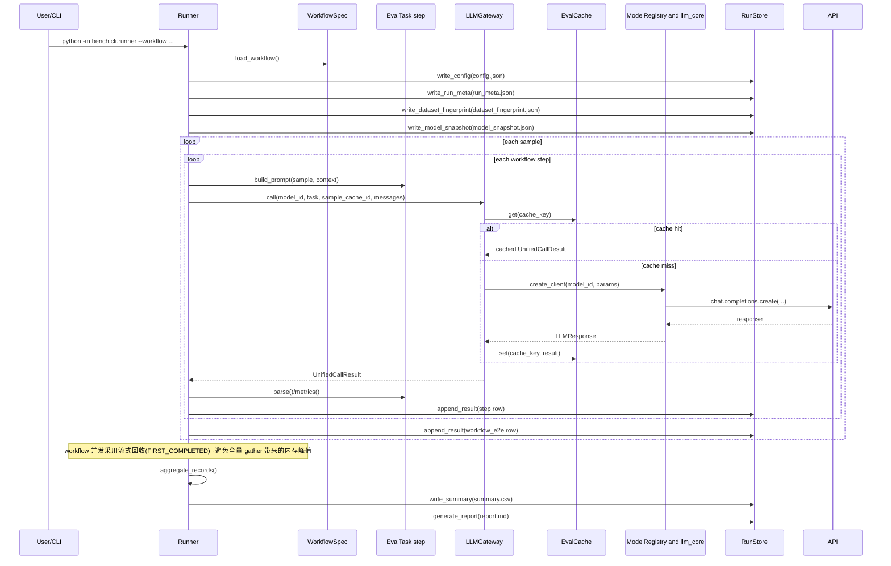

# 系统架构（当前实现审阅版）

本文档基于当前代码实现（`bench/` + `llm_core/`）整理，不是目标态设计图。

## 1. 架构总览图

```mermaid
flowchart TB
    %% ─────────── 样式定义 ───────────
    classDef input     fill:#EFF6FF,stroke:#3B82F6,stroke-width:2px,color:#1E3A5F,font-weight:bold
    classDef orch      fill:#F0FDF4,stroke:#22C55E,stroke-width:2px,color:#14532D,font-weight:bold
    classDef model     fill:#FFF7ED,stroke:#F97316,stroke-width:2px,color:#7C2D12,font-weight:bold
    classDef store     fill:#F5F3FF,stroke:#8B5CF6,stroke-width:2px,color:#3B0764,font-weight:bold
    classDef output    fill:#FFF1F2,stroke:#F43F5E,stroke-width:2px,color:#881337,font-weight:bold
    classDef task      fill:#ECFEFF,stroke:#06B6D4,stroke-width:2px,color:#164E63,font-weight:bold
    classDef api       fill:#FEFCE8,stroke:#EAB308,stroke-width:2px,color:#713F12,font-weight:bold

    %% ─────────── 输入层 ───────────
    subgraph INPUT["  📥 INPUT — 输入层  "]
        direction LR
        CLI["🖥️ CLI · python -m bench.cli.runner"]
        DS["📄 Dataset · *.jsonl"]
        WF_YAML["📋 Workflow Spec · news_pipeline.yaml"]
        REG_YAML["⚙️ Model Registry · llm_providers.json (default)"]
    end

    %% ─────────── 编排层 ───────────
    subgraph ORCH["  🎛️ ORCHESTRATOR — 编排层 (bench/)  "]
        direction TB
        RUNNER["🏃 Runner · cli/runner.py · 单任务 / workflow 入口"]
        WFL["🔀 WorkflowLoader · workflow.py · step 依赖 & input_from"]
        REG["📦 ModelRegistry · registry.py · 模型注册 + 成本估算"]
        GATE["🚪 LLMGateway · execution/gateway.py · 统一调用门面"]
        CACHE["💾 EvalCache · io/cache.py · model+params+messages 键"]
        MET["📊 Metrics · metrics/aggregate.py · aggregate_records()"]
        REP["📝 Reporter · reporting/reporter.py · MarkdownReporter"]
        ERR["🧭 Error Taxonomy · contracts/exceptions.py · 结构化错误元数据"]

        subgraph TASKS["  任务插件层 (bench/tasks/)  "]
            direction LR
            T_BASE["🔧 EvalTask · base.py · 抽象基类"]
            T_IE["📌 Task YAML · ie_json.yaml"]
            T_STOCK["📈 Task YAML · stock_score.yaml"]
            T_DEDUP["🗞️ Task YAML · news_dedup.yaml"]
            T_GEN["⚡ GenericTask · generic.py"]
        end
    end

    %% ─────────── 模型层 ───────────
    subgraph MODEL["  🤖 MODEL LAYER — 模型层 (llm_core/)  "]
        direction TB
        CLIENT_F["🏭 LLM Client Factory · base_client.py"]
        OAI["🔌 OpenAICompatibleClient · openai_client.py"]
        PROMPT["✏️ PromptRenderer · prompt_renderer.py · Jinja2 渲染"]
        PARSER["🔍 ResponseParser · response_parser.py"]
        BATCH["⚙️ BatchHelper · batch.py"]
    end

    %% ─────────── 存储层 ───────────
    subgraph STORE_L["  🗄️ STORE — 存储层 (bench/)  "]
        direction LR
        RSTORE["📁 RunStore · io/store.py · 产物读写抽象"]
        DATA_DIR["📂 runs/{timestamp}/"]
    end

    %% ─────────── 外部 API ───────────
    subgraph APIS["  🌐 外部 LLM API  "]
        direction LR
        DEEPSEEK["DeepSeek · API"]
        KIMI["Kimi · 月之暗面"]
        GPT["OpenAI · gpt-4o etc."]
        OTHERS["其他 · OpenAI-Compatible"]
    end

    %% ─────────── 输出产物 ───────────
    subgraph OUTPUT["  📤 OUTPUT — 输出产物  "]
        direction LR
        O_CFG["📄 config.json · 运行配置快照"]
        O_META["🧾 run_meta.json · 运行元信息"]
        O_DFP["🧬 dataset_fingerprint.json · 数据集指纹"]
        O_MSNAP["🤖 model_snapshot.json · 模型参数快照(脱敏)"]
        O_RES["📊 results.jsonl · 逐条结果 v1"]
        O_SUM["📋 summary.csv · 聚合统计 v1"]
        O_RPT["📝 report.md · 可读报告"]
    end

    %% ─────────── 配置文件 ───────────
    subgraph CONFIGS["  📁 CONFIGS  "]
        direction LR
        C_PROV["llm_providers.yaml · /json"]
        C_PROMPT["prompts/ · *.yaml"]
        C_ENV[".env · API Keys"]
    end

    %% ─────────── 数据集 ───────────
    subgraph DATASETS["  📂 DATASETS  "]
        direction LR
        D_BENCH["benchmark_news · .jsonl"]
        D_DEMO["demo_news · .jsonl"]
        D_EVAL["news_summary_eval · .jsonl"]
    end

    %% ─────────── 连接关系 ───────────
    CLI --> RUNNER
    DS --> RUNNER
    WF_YAML --> WFL --> RUNNER
    REG_YAML --> REG

    RUNNER --> TASKS
    RUNNER --> GATE
    RUNNER --> MET
    RUNNER --> REP
    RUNNER --> RSTORE
    RUNNER --> ERR

    T_BASE --> T_IE & T_STOCK & T_DEDUP & T_GEN

    REG --> GATE
    GATE <-->|"cache hit / miss"| CACHE
    GATE --> CLIENT_F

    CLIENT_F --> OAI
    OAI --> PROMPT
    OAI --> PARSER
    OAI --> BATCH

    OAI -->|"REST / SSE"| DEEPSEEK & KIMI & GPT & OTHERS

    MET --> RSTORE
    REP --> RSTORE
    RSTORE --> DATA_DIR

    DATA_DIR --> O_CFG & O_META & O_DFP & O_MSNAP & O_RES & O_SUM & O_RPT

    CONFIGS -.->|"加载"| REG & RUNNER & OAI
    DATASETS -.->|"读取"| RUNNER

    %% ─────────── 样式应用 ───────────
    class CLI,DS,WF_YAML,REG_YAML input
    class RUNNER,WFL,REG,GATE,CACHE,MET,REP orch
    class T_BASE,T_IE,T_STOCK,T_DEDUP,T_GEN task
    class CLIENT_F,OAI,PROMPT,PARSER,BATCH model
    class RSTORE,DATA_DIR store
    class DEEPSEEK,KIMI,GPT,OTHERS api
    class O_CFG,O_META,O_DFP,O_MSNAP,O_RES,O_SUM,O_RPT output
```

## 2. 执行时序（workflow 模式）

## 3. 当前实现要点（审阅结论）

1. 架构分层清晰：`cli/runner` 负责编排，`execution/gateway` 负责调用与缓存，`registry` 负责模型配置解析，`io/store + reporting` 负责产物落盘与展示。
2. 数据闭环完整：每次运行都会产出 `config + run_meta + dataset_fingerprint + model_snapshot + results + summary + report`。
3. workflow 依赖关系通过 `input_from` + 上游 `parse_success` 控制，失败会写入 `skipped` 记录并继续执行后续样本。
4. 当前并发能力：
   - task 模式支持按模型并发（`--concurrency`，模型级 semaphore）。
   - workflow 模式支持样本级并发（`--workflow-concurrency`），单样本内 step 仍保持顺序依赖，且采用流式回收避免全量 `gather` 的 OOM 风险。
5. 缓存命中粒度合理：键由 `model + params + messages + sample_cache_id` 组成，能覆盖 task/workflow 的重复调用复用。
6. `LLMGateway` 已对相同 `model_id + params_override` 复用 client，降低重复建连开销；重试退避引入 jitter，缓解限流惊群。
7. 错误处理采用结构化异常与错误元数据（`error_type/error_stage/error_code`），报告可按错误类型聚合。
8. 运行产物已带版本契约：`results.schema_version=result_row.v1`、`summary.schema_version=summary_row.v1`，并在 `run_meta.json` 中记录运行环境与版本字段。
9. 任务支持 `default_params`（如 `response_format: {type: json_object}`）并透传到模型调用。

## 4. 建议的下一步演进

1. 将 workflow 并发从“样本级”扩展到“DAG 级”（可并行的 step 分支调度）。
2. 为 `results.jsonl`/`summary.csv` 提供正式 JSON Schema 文件，并在 CI 中做契约校验。
3. 增加跨 run 基线对比报告（按 `task + model + prompt_version + scorer_version`）。
