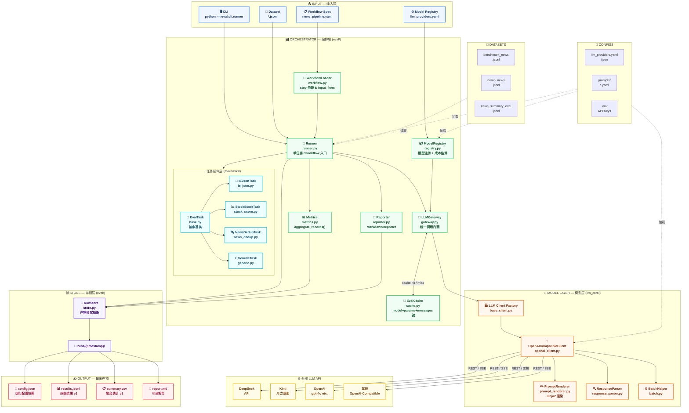
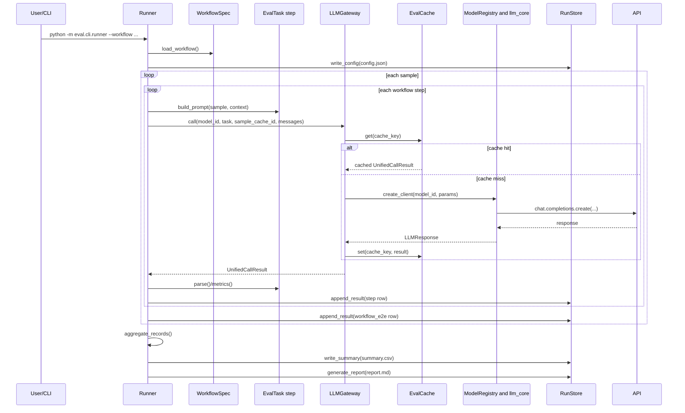

# 系统架构（当前实现审阅版）

本文档基于当前代码实现（`eval/` + `llm_core/`）整理，不是目标态设计图。

## 1. 架构总览图

## 2. 执行时序（workflow 模式）

## 3. 当前实现要点（审阅结论）

1. 架构分层清晰：`runner` 负责编排，`gateway` 负责调用与缓存，`registry` 负责模型配置解析，`store/report` 负责产物落盘与展示。
2. 数据闭环完整：每次运行都会产出 `config/results/summary/report`，满足最小可复现要求。
3. workflow 依赖关系通过 `input_from` + 上游 `parse_success` 控制，失败会写入 `skipped` 记录并继续执行后续样本。
4. 当前并发能力：
   - task 模式支持按模型并发（`--concurrency`，模型级 semaphore）。
   - workflow 模式支持样本级并发（`--workflow-concurrency`），单样本内 step 仍保持顺序依赖。
5. 缓存命中粒度合理：键由 `model + params + messages + sample_cache_id` 组成，能覆盖 task/workflow 的重复调用复用。
6. `LLMGateway` 已对相同 `model_id + params_override` 复用 client，降低重复建连开销。
7. 运行产物已带版本契约：`results.schema_version=result_row.v1`、`summary.schema_version=summary_row.v1`，`config.json` 含 `scorer_version`。

## 4. 建议的下一步演进

1. 将 workflow 并发从“样本级”扩展到“DAG 级”（可并行的 step 分支调度）。
2. 为 `results.jsonl`/`summary.csv` 提供正式 JSON Schema 文件，并在 CI 中做契约校验。
3. 增加跨 run 基线对比报告（按 `task + model + prompt_version + scorer_version`）。
